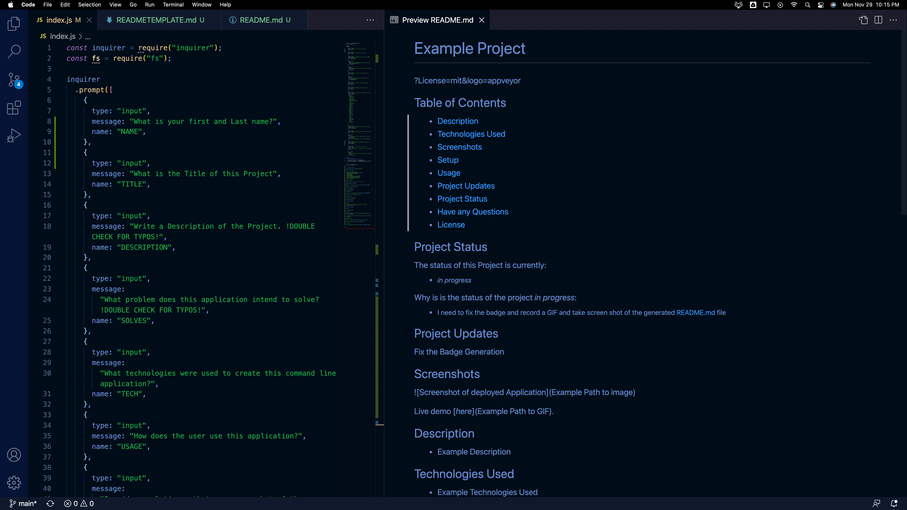

  
  # README Generator

?License=mit&logo=appveyor

## Table of Contents

- [Description](#description)
- [Technologies Used](#technologies-used)
- [Demonstration](#demonstration)
- [Setup](#setup)
- [Usage](#usage)
- [Project Updates](#project-updates)
- [Project Status](#project-status)
- [Have any Questions](#questions)
- [License](#license)

## Project Status

#### The status of Project README Generator is currently:

- ##### _in progress_

#### Why is is the status of the Project _in progress_:

- ##### Still working on badge generation

## Project Updates

Fix the badge generation

## Demonstration

Live demo [_here_](assets/images/READMEGenerator.gif).

## Description

- A node.js driven file generator that creates a RREADME.md file.

## Technologies Used

- node.js inquirer, fs 

## Setup

To use this application, you must have the following technologies installed:

- node.js inquirer and fs npm

## Usage

- The user launches in the Terminal node index.js to launch a series of prompts. Upon completion a file will be written.

## Questions

This application was created by: [Jason Lutz](mailto:LutzJason92@gmail.com)

- I encourage you to send me an email if you have any questions or comments. 

## Contributors

Thank you to these GitHub users for thier contributions:

- https://github.com/LutzJason92

## License

- This appplication is currently using a mit license.

  