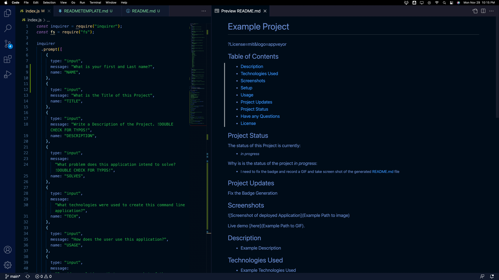

  
  # README.md Generator

[]

## Table of Contents

- [Description](#description)
- [Technologies Used](#technologies-used)
- [Demonstration](#demonstration)
- [Setup](#setup)
- [Usage](#usage)
- [Project Updates](#project-updates)
- [Project Status](#project-status)
- [Have any Questions](#questions)
- [License](#license)

## Project Status

#### The status of Project README.md Generator is currently:

- ##### _complete_

#### Why is is the status of the Project _complete_:

- ##### mission accomplished

## Project Updates

none

## Demonstration

Live demo [_here_](assets/images/READMEGenerator.gif).

## Description

- README.md Generator, is a command line application that automatically generates a README.md file upon completion of prompts.

## Technologies Used

- inquire, fs, node.js and JS

## Setup

To use this application, you must have the following technologies installed:

- User must have inquirer and Node.js installed

## Usage

- open folder in intergated terminal and execute node index.js and the terminal will display the user prompts

## Questions

This application was created by: [Jason Lutz](mailto:LutzJason92@gmail.com)

- I encourage you to send me an email if you have any questions or comments. 

## Contributors

Thank you to these GitHub users for thier contributions:

- https://github.com/LutzJason92

## License

- This appplication is currently using a mit license.

  